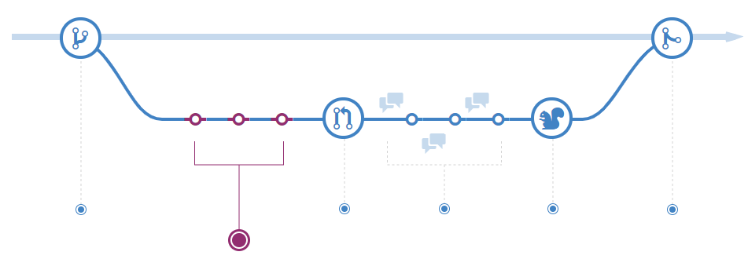
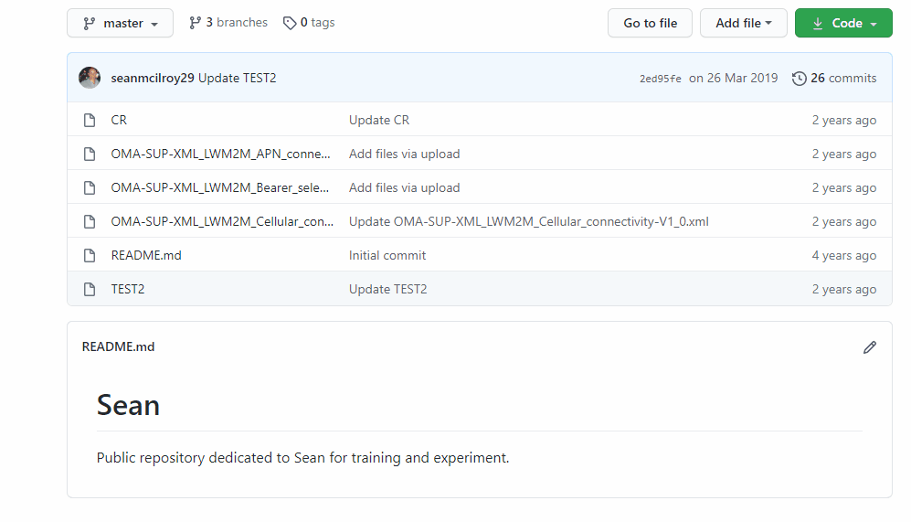

<!-- Edit the content below for the workshop in question. Once you're ready to publish, remove the comment characters e.g. "<!--" at the start and end -->

# Make and commit changes
On GitHub, saved changes are called commits. Each commit has an associated commit message, which is a description explaining why a particular change was made. Commit messages capture the history of your changes, so other contributors can understand what you’ve done and why.



## Steps to commit changes
1. Click the file to be changed.
1. Click the  pencil icon in the upper right corner of the file view to edit.
1. In the editor, write a bit about yourself.
1. Write a commit message that describes your changes.
1. Click **Commit changes** button.

> These changes will be made to just the file on your ```feature_branch``` selected, so now this branch contains content that’s different from the ```master```.



<!--

## Workshop recording

<iframe height="480" width="853" allowfullscreen frameborder=0 src="https://echo360.ca/media/4378b2ec-7d0c-4632-a1e4-5a8076a494da/public?autoplay=false&automute=false"></iframe>

View the original [here](https://echo360.ca/media/4378b2ec-7d0c-4632-a1e4-5a8076a494da/public).


## Workshop slides

<div style="position:relative;padding-top:66.25%;">
<iframe src="//docs.google.com/viewer?url=https://github.com/scds/intro-tableau/raw/main/assets/docs/tableau_20201118.pdf?dl=0&hl=en_US&embedded=true" class="gde-frame" style="position:absolute;top:0;left:0;width:100%;height:100%;border:none;" scrolling="no"></iframe>
</div>
[Download as a PDF](https://github.com/scds/intro-tableau/raw/main/assets/docs/tableau_20201118.pdf)
<br>

## Worksheets
**Coming soon!**

-->
