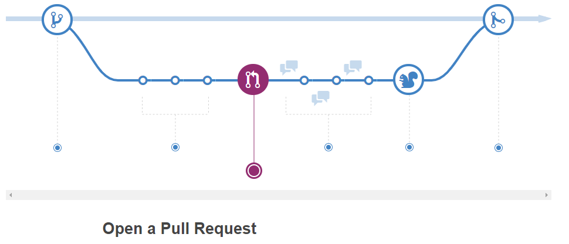
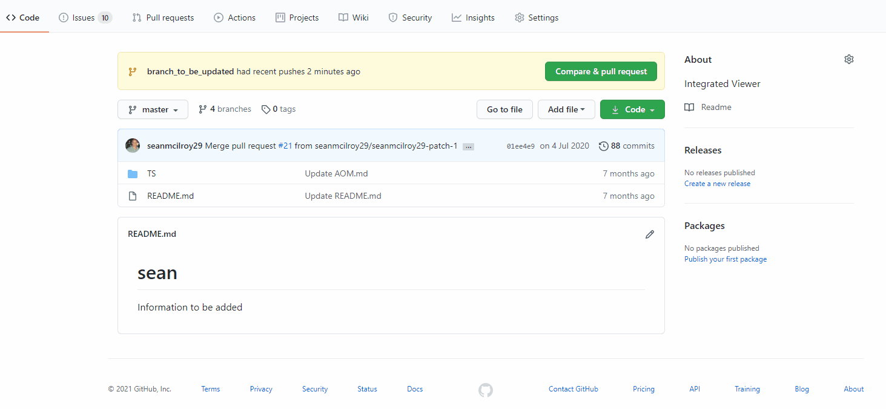

<!-- Edit the content below for the workshop in question. Once you're ready to publish, remove the comment characters e.g. "<!--" at the start and end -->

# Creating a Pull Request
Now that you have made some changes you now need to push your changes back to the shared repository for collaboration.

>Review - When you are making line comments, you can also choose to **Start a Review**. When you create a review, you can group many line comments together with a general message: Comments, Approve, or Request Changes. Reviews have special power in GitHub when used in conjunction with protected branches.

## PR Review
One of the best ways to ensure code quality is to make peer reviews a part of every Pull Request.

1. Click the **Pull Request** tab.
2. Use the **Author** drop down to locate your pull request.
3. Click the **Files Changed** tab.
4. Hover over a single line in the file to see the blue +. Click the + to add a line comment.
5. Comment on the line and click **Start a review**.
6. Add additional line comments to the pull request.
7. Click **Review changes** in the top right corner.
8. Choose whether to **Approve** or **Request changes**
9. Enter a general comment for the review.
10. Click **Submit review**
11. Click the **Conversation** tab to check out your completed review.

<!--

## Workshop recording

<iframe height="480" width="853" allowfullscreen frameborder=0 src="https://echo360.ca/media/4378b2ec-7d0c-4632-a1e4-5a8076a494da/public?autoplay=false&automute=false"></iframe>

View the original [here](https://echo360.ca/media/4378b2ec-7d0c-4632-a1e4-5a8076a494da/public).

## Workshop slides

<iframe src="//docs.google.com/viewer?url=https://github.com/scds/intro-tableau/raw/main/assets/docs/tableau_20201118.pdf?dl=0&hl=en_US&embedded=true" class="gde-frame" style="position:absolute;top:0;left:0;width:100%;height:100%;border:none;" scrolling="no"></iframe>

[Download as a PDF](https://github.com/scds/intro-tableau/raw/main/assets/docs/tableau_20201118.pdf)
 

## Worksheets
**Coming soon!**

-->
