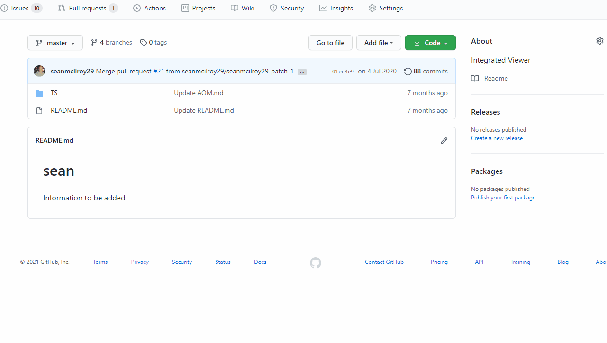

<!-- Edit the content below for the workshop in question. Once you're ready to publish, remove the comment characters e.g. "<!--" at the start and end -->

# Adding Comments to Pull Request on GitHub

Since you created the pull request, you will be notified when someone adds a comment or a review. Sometimes, the reviewer will ask you to make a change to the file you just created. Let's see how GitHub makes this easy.

## Adding line comments to a pull request

1. Under your repository name, click **Pull requests**.
2. In the list of pull requests, click the pull request where you'd like to leave line comments.
3. On the pull request, click **+/-  Files changed**.
4. Hover over the line of code where you'd like to add a comment, and click the blue comment icon. To add a comment on multiple lines, click and drag to select the range of lines, then click the **blue comment** icon.Blue comment icon
5. In the comment field, type your comment.
> Optionally, to suggest a specific change to the line or lines, click **+/-** , then edit the text within the suggestion block.

When you're done, click **Add single comment.**
> Anyone watching the pull request or repository will receive a notification of your comment.

## Editing a File on GitHub

To edit a pull request file, you will need to access the **Files changed** tab.

1. Click ![octicon-kebab-horizontal] in the top right corner of the diff.
1. Click **Edit file** to edit the file using the GitHub file editor.
1. Make changes to the file based on the comments from your reviewer or your personal perspective.

<!--

## Workshop recording

<iframe height="480" width="853" allowfullscreen frameborder=0 src="https://echo360.ca/media/4378b2ec-7d0c-4632-a1e4-5a8076a494da/public?autoplay=false&automute=false"></iframe>

View the original [here](https://echo360.ca/media/4378b2ec-7d0c-4632-a1e4-5a8076a494da/public).

## Workshop slides

<iframe src="//docs.google.com/viewer?url=https://github.com/scds/intro-tableau/raw/main/assets/docs/tableau_20201118.pdf?dl=0&hl=en_US&embedded=true" class="gde-frame" style="position:absolute;top:0;left:0;width:100%;height:100%;border:none;" scrolling="no"></iframe>

[Download as a PDF](https://github.com/scds/intro-tableau/raw/main/assets/docs/tableau_20201118.pdf)
 

## Worksheets
**Coming soon!**

-->
